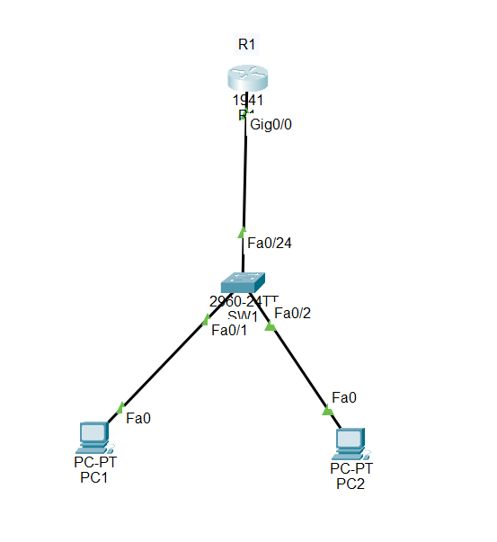

# Enterprise Network Security Lab

## Objective

Designed and configured a small enterprise network using Cisco Packet Tracer, implementing VLAN segmentation, inter-VLAN routing, SSH-based secure management, and basic switch security.

## Network Components

- 2 PCs
- 1 Cisco 2960 switch
- 1 Cisco 1941 router

## Networking Concepts Demonstrated

- VLAN segmentation
- Inter-VLAN routing
- Router-on-a-stick
- IPv4 addressing
- SSH secure management
- Local user authentication
- Switch port security
- Unused port isolation
- Network connectivity testing

## Network Topology

## VLAN Configuration

### VLAN 10 — USERS

- **VLAN ID:** `10`
- **Name:** `USERS`
- **Network:** `192.168.10.0/24`
- **Gateway:** `192.168.10.1`
- **PC1:** `192.168.10.10`
- **SW1 Management:** `192.168.10.2`

### VLAN 20 — ADMIN

- **VLAN ID:** `20`
- **Name:** `ADMIN`
- **Network:** `192.168.20.0/24`
- **Gateway:** `192.168.20.1`
- **PC2:** `192.168.20.10`

### VLAN 999 — UNUSED

- **VLAN ID:** `999`
- **Name:** `UNUSED`
- **Purpose:** Unused switch ports are placed in this VLAN and administratively shut down.

## IP Addressing

- **R1 G0/0.10:** `192.168.10.1/24`
- **R1 G0/0.20:** `192.168.20.1/24`
- **SW1 VLAN 10:** `192.168.10.2/24`
- **PC1:** `192.168.10.10/24`
- **PC2:** `192.168.20.10/24`

## Router Configuration

R1 was configured using router-on-a-stick to provide inter-VLAN routing.

Configuration:

    interface gigabitEthernet 0/0.10
     encapsulation dot1Q 10
     ip address 192.168.10.1 255.255.255.0

    interface gigabitEthernet 0/0.20
     encapsulation dot1Q 20
     ip address 192.168.20.1 255.255.255.0

## Switch Configuration

SW1 was configured with VLANs for network segmentation.

Configuration:

    vlan 10
     name USERS

    vlan 20
     name ADMIN

    vlan 999
     name UNUSED

### Access Ports

    interface fastEthernet 0/1
     switchport mode access
     switchport access vlan 10

    interface fastEthernet 0/2
     switchport mode access
     switchport access vlan 20

### Trunk Port

Fa0/24 connects SW1 to R1 and carries VLAN 10 and VLAN 20 traffic.

    interface fastEthernet 0/24
     switchport mode trunk

## SSH Configuration

SSH was configured on SW1 for secure remote management.

### Local User

    username admin privilege 15 secret admin123

### SSH Configuration

    ip domain-name enterprise.local
    crypto key generate rsa

    line vty 0 15
     login local
     transport input ssh

SSH access was successfully tested from PC1 using:

    ssh -l admin 192.168.10.2

The connection successfully reached the `SW1#` prompt.

## Switch Management

SW1 was assigned a management IP address on VLAN 10.

    interface vlan 10
     ip address 192.168.10.2 255.255.255.0
     no shutdown

    ip default-gateway 192.168.10.1

## Console Security

Local console access was configured to use the local administrator account.

    line console 0
     login local

## Unused Port Security

Unused switch ports from Fa0/3 through Fa0/23 were placed into VLAN 999 and administratively shut down.

    interface range fastEthernet 0/3-23
     switchport mode access
     switchport access vlan 999
     shutdown

This prevents unused physical ports from being available for normal network access.

## Connectivity Tests

The following tests were successfully completed:

- **PC1 → R1 VLAN 10 gateway:** Successful
- **PC2 → R1 VLAN 20 gateway:** Successful
- **PC1 → PC2:** Successful
- **PC1 → SW1 management IP:** Successful
- **PC1 → SW1 using SSH:** Successful
- **SSH authentication:** Successful
- **Inter-VLAN routing:** Successful

## Verification Commands

The following Cisco IOS commands were used to verify the configuration.

    show ip ssh
    show ip interface brief
    show interfaces trunk
    show vlan brief
    show interfaces status

## Security Features Implemented

- VLAN-based network segmentation
- Inter-VLAN routing
- SSH instead of Telnet for remote management
- Local administrator authentication
- Privileged EXEC password protection
- Console authentication
- Unused VLAN for unused ports
- Administrative shutdown of unused ports
- Secure switch management

## Technologies Used

- Cisco Packet Tracer
- Cisco IOS
- Cisco 1941 Router
- Cisco 2960 Switch
- VLAN
- Router-on-a-stick
- SSH
- IPv4
- Ethernet

## Project Files

- `enterprise-network-security-lab.pkt` — Cisco Packet Tracer project
- `topology.png` — Network topology screenshot
- `README.md` — Project documentation

## Conclusion

This project demonstrates how VLAN segmentation, inter-VLAN routing, SSH management, and basic switch security controls can be combined to create a structured enterprise network.

The network was tested successfully for VLAN connectivity, inter-VLAN routing, secure SSH management, and unused-port isolation.
